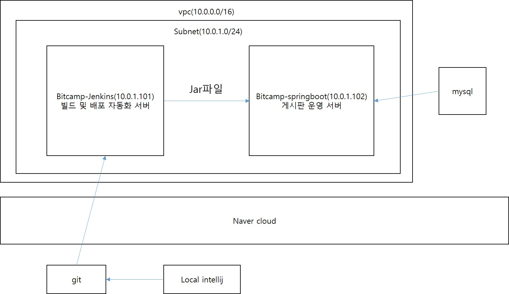

# 1. Jenkins
## 1. Jenkins란?
### 1. Jenkins는 CI(Continuous Integration: 지속적인 통합)/CD(Continuous Delivery: 지속적인 배포)를 지원하는 미들웨어
### 2. 개발자가 git이나 svn 등에 변경사항을 커밋하면 jenkins 설정에 따라서 테스트, 빌드, 배포 자동화
### 3. 

## 2. docker에 jenkins 컨테이너 설치 및 실행
### 1. 네트워크 브릿지 생성
- docker network create jenkins
- docker network ls
### 2. 젠킨스 이미지 가져오기
- docker image pull jenkins/jenkins:lts-jdk17
- docker image ls
### 3. 도커 이미지 생성: 젠킨스 + jdk17 + 도커클라이언트
- 작업 폴더 생성
    - mkdir jenkins
    - cd jenkins
- docker 설치 쉘 스크립트 작성
    - vi install-docker.sh
    ```
    #!/bin/sh

    apt-get update

    apt-get -y install apt-transport-https \
        apt-utils \
        ca-certificates \
        curl \
        gnupg2 \
        zip \
        unzip \
        acl \
        software-properties-common

    curl -fsSL https://download.docker.com/linux/$(. /etc/os-release; echo "$ID")/gpg > /tmp/dkey; apt-key add /tmp/dkey

    add-apt-repository \
    "deb [arch=amd64] https://download.docker.com/linux/$(. /etc/os-release; echo "$ID") \
    $(lsb_release -cs) \
    stable" && \

    apt-get update

    apt-get -y install docker-ce
    ```
- docker 빌드 파일 생성
    - vi Dockerfile
    ```
    FROM jenkins/jenkins:lts-jdk17

    USER root

    COPY install-docker.sh /install-docker.sh
    RUN chmod +x /install-docker.sh
    RUN /install-docker.sh

    RUN usermod -aG docker jenkins
    RUN setfacl -Rm d:g:docker:rwx,g:docker:rwx /var/run/

    USER jenkins
    ```

- docker image 생성
    - docker build -t statsdev/jenkins:1.0 .
- docker hub에 생성한 이미지 배포
    - docker login
    - docker push statsdev/jenkins:1.0

- jenkins 컨테이너 생성 및 실행
     - docker run --privileged -d -v /var/run/docker.sock:/var/run/docker.sock -v jenkins_home:/var/jenkins_home -p 8080:8080 -p 50000:50000 --restart=on-failure --network="jenkins" --name docker-jenkins statsdev/jenkins:1.0

### 4. 젠킨스 설정
- 젠킨스 접속
    - http://bitcamp-jenkins서버의 public ip:8080
- 젠킨스 관리자 암호 찾기
    - docker logs docker-jenkins 